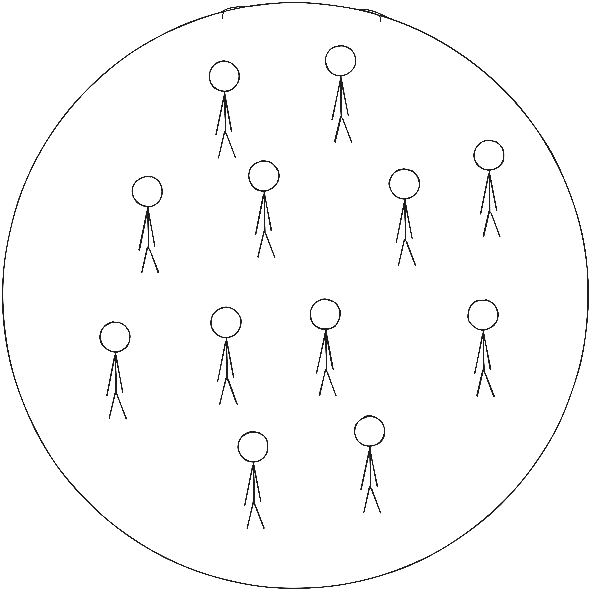

# Introduction

. . .

<!-- Image à gauche -->

  {height=400px}

<!-- Texte à droite -->

::: incremental
- **Title:** There Is No Such Thing as Cultural Identity (2013)
- **Author:** François Jullien
- **Publication Date:** 2013
:::

---

**Context**

François Jullien is a French philosopher and sinologist, exploring how Chinese thought challenges Western concepts.

. . .

**Main question**

*Does “cultural identity” really exist, or is it a misleading concept?*

---

**Aim**

Understand why Jullien rejects the idea of fixed identities  
and what he proposes instead: *a culture in motion and transformation.*

---

# Around the text: thesis

. . .

**There Is No Such Thing as Cultural Identity**

. . .

How to define culture?

***

. . .

**Answer: through differences**

. . .

{height=300px}
{height=300px}

. . .

$\Rightarrow$ **Dead end**

***

<!-- Bloc Image 3 + Description -->

  {height=150}
  

Humanity

<!-- Flèche -->

→

<!-- Bloc Image 2 + Description -->

  {height=150}
  
Groups

<!-- Flèche -->

→

<!-- Bloc Image 1 + Description -->

  {height=150}
  

Individuals

. . .

$\Rightarrow$ **What is in common?**

. . .

X ? "Common ground"? "Human nature"?

. . .

**Ideology: no evidence**

---

## Culture

. . .

The essence of culture: **the plural** + **the singular**

. . .

Humanity → Individuals

* * *

<video
  data-autoplay
  src="Stickman.mp4"
></video>

---

## Culture

. . .

Fixed cultural identity = does not exist

. . .

Culture is in motion, otherwise dead (a dead language).

. . .

$\Rightarrow$ Ex. **The French culture:**

---

## The French culture

  {height=150}
    

La Fontaine ?

<!-- Bloc Image 3 + Description -->

  {height=150}
    

Rimbaud ?

. . .

René Descartes ? André Breton ?

. . .

$\Rightarrow$ What defines it? Who?

---

# Culture and creativity

. . .

What seems “exceptional” → is what is **most creative**

. . .

The gap between norms and exceptions = the true **resource of culture**

---

# The danger of “identity”

. . .

Approaching cultures as **fixed identities** = politically dangerous

. . .

History shows the risks of this misconception

---

# Example: Huntington

. . .

**The Clash of Civilisations (1996)**

* Cultures reduced to types: *“Chinese”*, *“Islamic”*, *“Western”*
* Fixed differences → fixed identities
* Leads inevitably to **conflict** (“clash”)

. . .

$\Rightarrow$ No attention to **internal diversity**
$\Rightarrow$ Cultures reduced to clichés

---

# Internal diversity

. . .

Culture lives through its **internal tensions** (“heterotopias”)

. . .

No “hard core” of a culture, but **constant mutation**

---

# Example: Europe

. . .

Attempt to define **European identity** → failure

* Christian roots?
* Or secular Enlightenment?

. . .

No agreement → **no Constitution**

---

# Europe’s strength

. . .

Europe = **both** Christian **and** secular

. . .

Strength lies in the **gap**:

* Faith ↔ Reason
* Religion ↔ Enlightenment

. . .

This tension creates Europe’s **richness**

---

# Arguments For / Against

---

<!-- Colonne de gauche -->

### Arguments For *(fixed identity)*

- Creates belonging and social cohesion  
- Gives individuals pride and continuity  
- Simplifies intercultural understanding (shared codes)

<!-- Colonne de droite -->

### Arguments Against *(Jullien)*

- Freezes culture into stereotypes  
- Hides internal diversity and creativity  
- Leads to ideological or political misuse  

# Conclusion

. . .

* No fixed cultural identity  
* Culture = **movement and transformation**  
* Richness lies in **tensions and differences**  
* Identity-based thinking = reduction and risk  

. . .

> “Culture only exists through its transformations, not its essence.”  
> — *François Jullien*

. . .

$\Rightarrow$ **Culture exists in the in-between**

---

# Discussion

. . .

* Is it possible to preserve diversity without “cultural identities”?  
* Do you agree that fixed identity is politically dangerous?  
* Can globalization destroy or enrich cultures?  
* What does “being European” mean today?

---

# Thanks for your attention !
